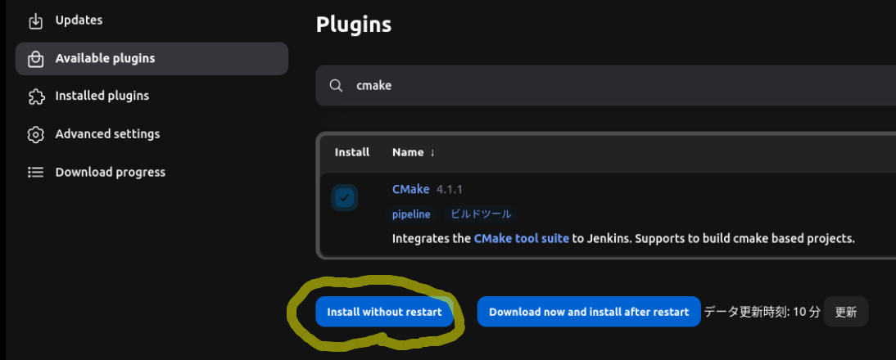
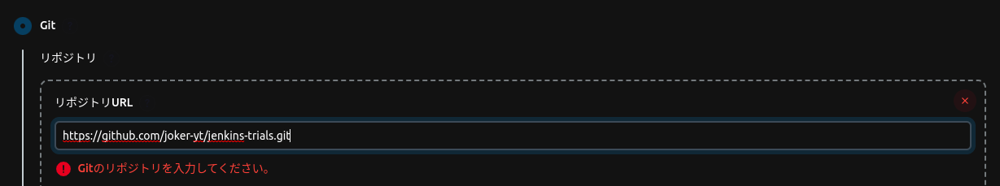
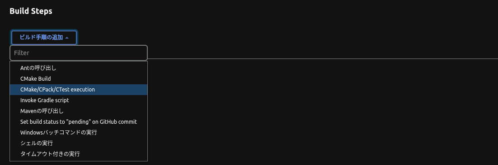
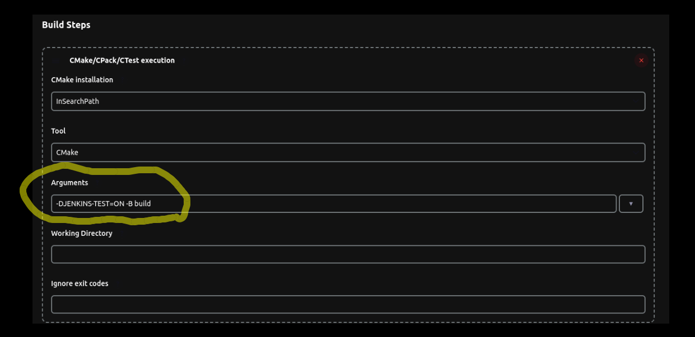
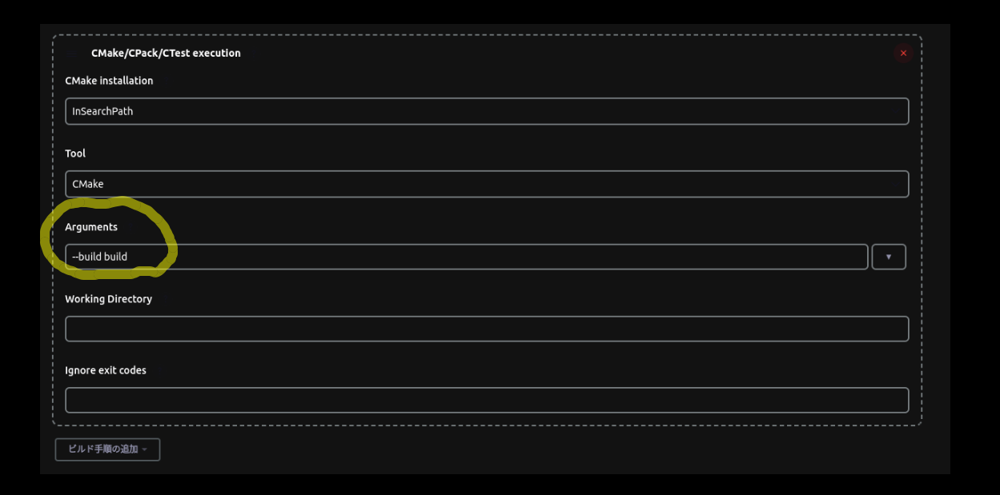

# jenkins-trials
## reference
https://hub.docker.com/_/jenkins/

## Environment
- Ubuntu 20.04
- cmake 3.22
- googletest 1.11.0-3
- libgtest-dev 1.11.0-3
- g++-11.3.0

## Usage
### Testing itself
1. cmake -DJENKINS-TEST=ON -S . -B build
1. cmake --build build
1. cd build/test
1. ctest

### build and run docker image, container of Jenkins
1. cd env
1. docker build . -t <image-name>
1. docker run -p 8080:8080 -p 50000:50000 <image-name>
1. (Installing Jenkins) select "Install suggested plugins"
1. (Installing Jenkins) View Configuration
1. (Installing Jenkins) add CMake plugin
1. (Installing Jenkins) create new job
1. (Installing Jenkins) select "Free Style Project"
1. (Installing Jenkins) fill "git repository url"
1. (Installing Jenkins) select CMake/CPack/CTest execution as build step
1. (Installing Jenkins) create another CMake/CPack/CTest execution to build application
1. (Installing Jenkins) save and start building

### How to access docker container
docker exec -it <container name> /bin/bash

### change sudo user
su - test

## todo
- link, include file check
- memory
- excuting time
- C0, C1 -> gcovr + Cobertura
- ■doxygen
- gmock, gtest
- sonarqube
- redmine + hubot -> ticket log
http://qiita.com/tenten0213/items/91b9598cf1edf930df0c
